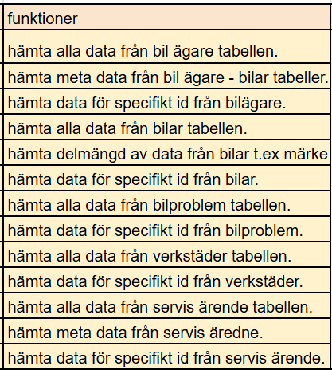
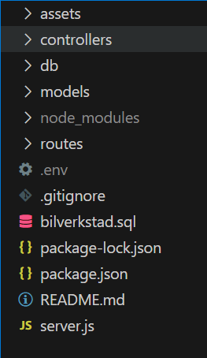
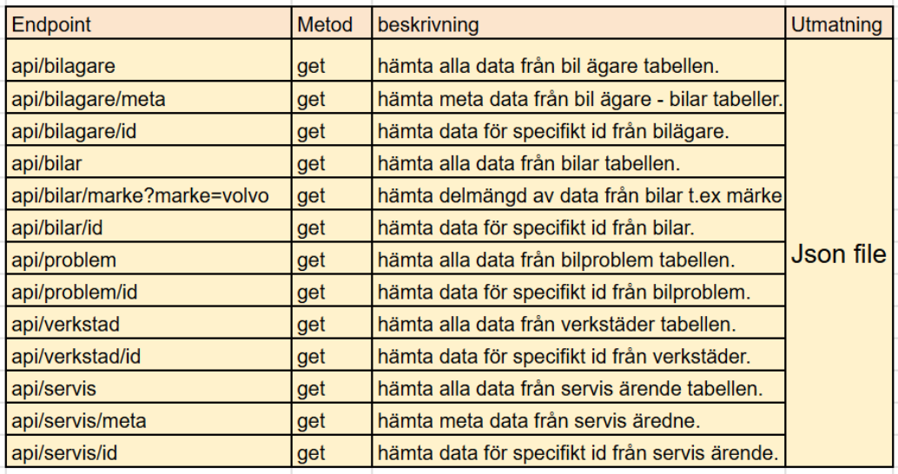

# Slutprojekt Node.js | Bilverkstad-API

Detta projekt handlar om att skapa ett API med Node.js, Express.js och MySQL. API:et hämtar data från databasen och visar den som JSON.

## Funktioner


## 🛠️Teknologier 
Projektet är byggt med:

Node.js

Express.js

MySql

MySql2

Dotenv

## 📂 Projektstruktur



## ⚙️ Installation och uppstart

#### Installera 

```bash
Node.js
MySQL2
```

#### Klona projektet
```bash
git clone https://github.com/Mahdi-0011/Slutprojekt-Node.js.git

cd projekt-namn
```
#### Installera beroenden
```bash
npm install
```

#### Importera bilverkstad.sql filen

skapa databas
```bash
CREATE DATABASE bilverkstad;
```
sedan
```bash
mysql -u root -p bilverkstad < bilverkstad.sql
```

#### Skapa .env-fil
```bash
PORT=3000
DB_HOST=localhost
DB_USER=root
DB_PASSWORD=din-lösen
DB_NAME=databasnamn
```
#### Starta projektet
```bash
node server.js
```
## 🔑 API Endpoints



## 📧 Email
Mahdi.mousavi0011@gmail.com

